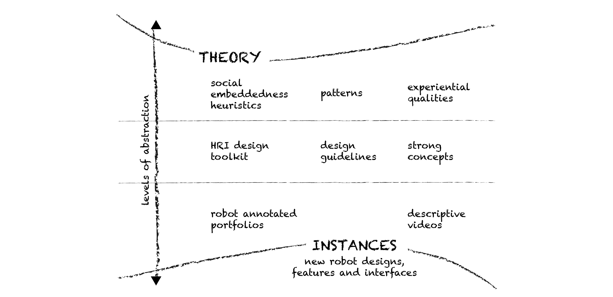

### A half-day workshop on Designerly HRI Knowledge. Held in conjunction with the 29th IEEE International Conference on Robot and Human Interactive Communication ([RO-MAN 2020](http://ro-man2020.unina.it/index.php))
##### Naples, Italy, September 4, 2020.

This workshop, which will bring HRI and HCI together, is dedicated to the investigation of designerly forms of knowledge in HRI. In particular, we will discuss the concept of intermediate-level knowledge through the specific perspective of HRI studies. 

###### Exemple forms of intermediate level knowledge in HRI, based on the "Intermediate-level knowledge" schema by Hook and Lowgren, 2012.

The ultimate goal is to extend the state-of-art of HRI knowledge, by bridging it with the design discipline. 
By exploring perspectives, approaches, methods, tools, techniques, and contributions that fall within the concept of [intermediate-level knowledge](http://mobilelifecentre.org/sites/default/files/a23-hook.pdf), we will start a conversation on what HRI design epistemology is (i.e., the study of knowledge creation) and could be, and how to evaluate and legitimate knowledge produced through HRI design practices.

#### Confirmed Speakers

**Guy Hoffman**
Head of Human-Robot Collaboration & Companionship ([HRC2](https://hrc2.io/)) Lab at Cornell University (USA).

**Ron Wakkary**

---

### Call for designerly HRI contributions
Design contributions have been steadily growing in Human-Robot Interaction (HRI) studies. The majority of these, however, usually tend to produce insights and knowledge adapting to modalities typical of the HRI research community, such as introducing a (novel) robot platform and empirically evaluating it in order to obtain a generalizable understanding of the interaction between humans and robots. Despite being relevant and necessary, this approach to knowledge production often misses the opportunity to construct forms of knowledged belonging to another level, in between the concretness of robotic instances and the abstraction of theories. These include design methodologies, guidelines, heuristics, patterns, concepts, experiential qualities, and annotated portfolios. Although partial discussions about these forms of knowledge can already be found in the HRI, comprehensive investigations are still lacking.
This workshop aims at creating a venue for discussing relevant forms of intermediate-level knowledge and understanding what might be their specific contribution in HRI.
To this end, we strongly encourage submissions from researchers that work at the intersection of Human-Robot Interaction studies and Design Research. 

_Topics include but are not limited to:_
- HRI and interaction design
- Design and prototyping of robotic artifacts
- Robot aesthetics
- Design methods, tools, techniques in HRI
- HRI heuristics
- Human-centered robotics
- Participatory practices in HRI
- Speculative and Critical Design in HRI

#### Submissions
Authors are invited to prepare a position paper (2-4 pages including references) using the IEEE [template](https://www.ieee.org/conferences/publishing/templates.html), and submit via email at: _gianni@pino.com_

Participants’ contributions will be published on our website and on Arxiv. A joint publication may emerge as a report of the workshop outcomes.

---

### Important Dates
Submission deadline: **20/06/2020**  
Notification of acceptance: **15/07/2020** 
Camera-ready submission: **31/07/2020**  
Workshop: **04/09/2020**  

---

#### Organizers

##### **Maria Luce Lupetti**
is a postdoctoral design researcher at TU Delft and part of the [AiTech](https://www.tudelft.nl/aitech/projects/embodied-manifestos-of-human-ai-partnerships/) research initiative. Her research focuses on developing methods critical and responsible design of AI and robotics. She holds a PhD cum Laude in “Production, Management and Design” from Politecnico di Torino, Italy (2018). Her doctoral research, focused on child-robot playful interactions, was funded by the Italian telecommunication company TIM. Prior to this position, she was a Research Fellow at Amsterdam Metropolitan Solution Institute (2018-2019) and visiting scholar at X-Studio, Academy of Art and Design, Tsinghua University, Beijing, China (2016-2017).

##### **Cristina Zaga**
is an assistant professor at the [Human-Centred Design Group](https://www.utwente.nl/en/et/dpm/hcd/#staff) (Design and Production Management department) and at [The DesignLab](https://www.utwente.nl/en/designlab/) at the University of Twente. She researches methods on designing for embodied AI agency (i.e., robots and IOTs) and democratizing human-robot interaction design. At the DesignLab, she develops methods, tools, and techniques for transdisciplinary responsible design for social good.

##### **Nazli Cila**
is a design researcher and teacher at the Faculty of Media and Creative Industries, the [Digital Life Center](http://www.digitallifecentre.nl/team/dr-nazli-cila) research group of the Amsterdam University of Applied Sciences. She studied product design and obtained the PhD degree from Delft University of Technology, Department of Industrial Design working on the topic of how designers can create effective and aesthetic metaphors to communicate with users through products.

